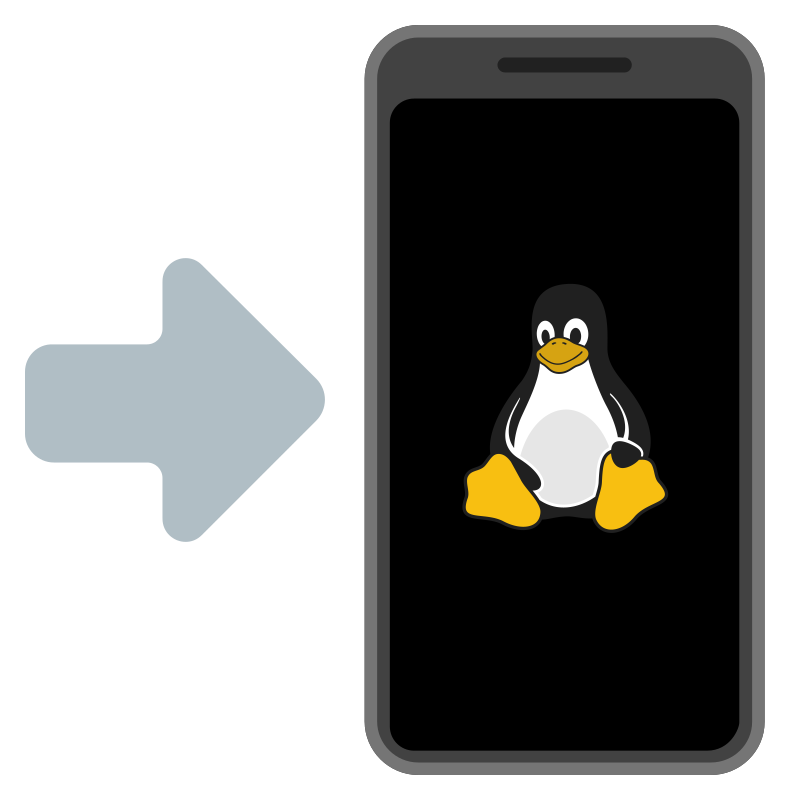

# Sidestep

A user-friendly wizard for unlocking Android bootloaders and installing mobile Linux distributions.



## Features

- **Automatic device detection** via USB
- **Step-by-step bootloader unlocking** wizard
- **One-click distro installation** with progress tracking
- **Real-time terminal output** for troubleshooting
- **Fail-safe design** with clear warnings

## Supported Devices (MVP)

| Device | Codename | Status |
|--------|----------|--------|
| Google Pixel 3a | sargo | ✅ Supported |
| OnePlus 6 | enchilada | ✅ Supported |
| Microsoft Surface Duo | zeta | ⚠️ Experimental |

## Supported Distributions

- **postmarketOS** - Alpine-based mobile Linux

## Building

### Requirements

- Rust 1.75+
- meson >= 0.59
- GTK4 >= 4.12
- Libadwaita >= 1.6
- blueprint-compiler

### From Source

```bash
./build.sh --dev
./build-dir/sidestep
```

### Flatpak

```bash
flatpak-builder --user --install build packaging/io.github.tobagin.Sidestep.yml
flatpak run io.github.tobagin.Sidestep
```

## License

GPL-3.0-or-later
