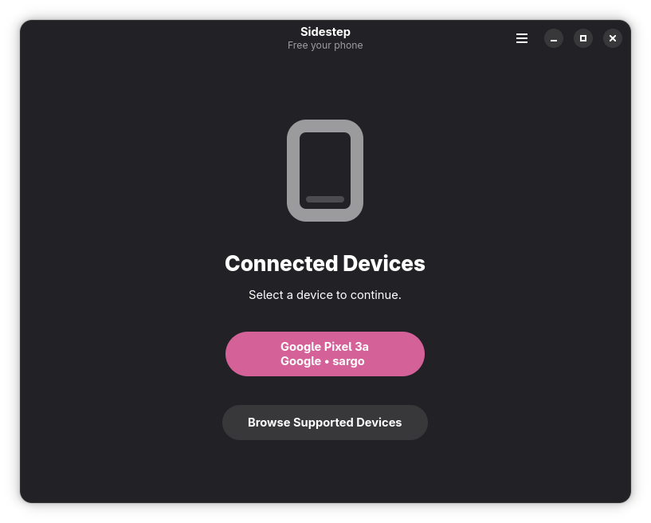
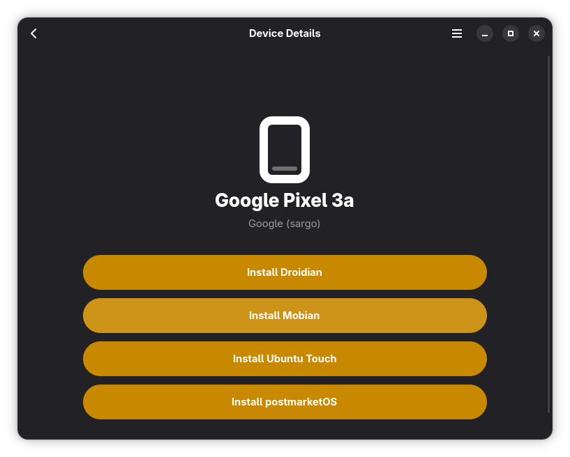
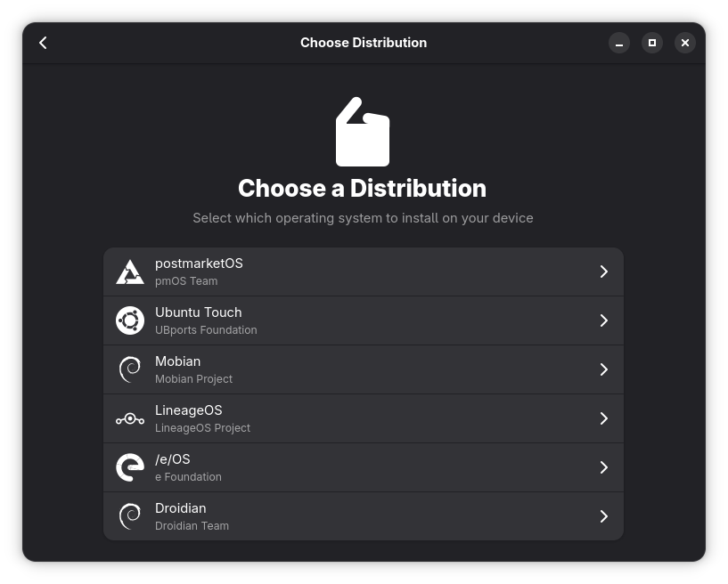
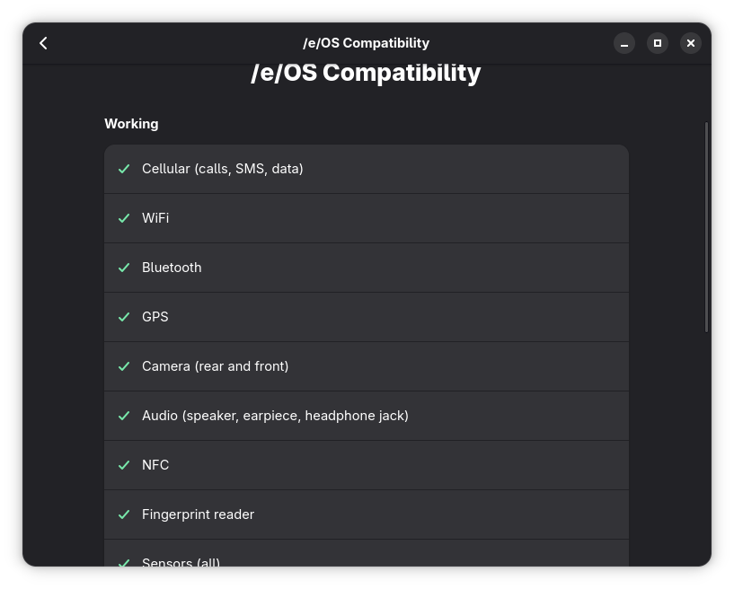
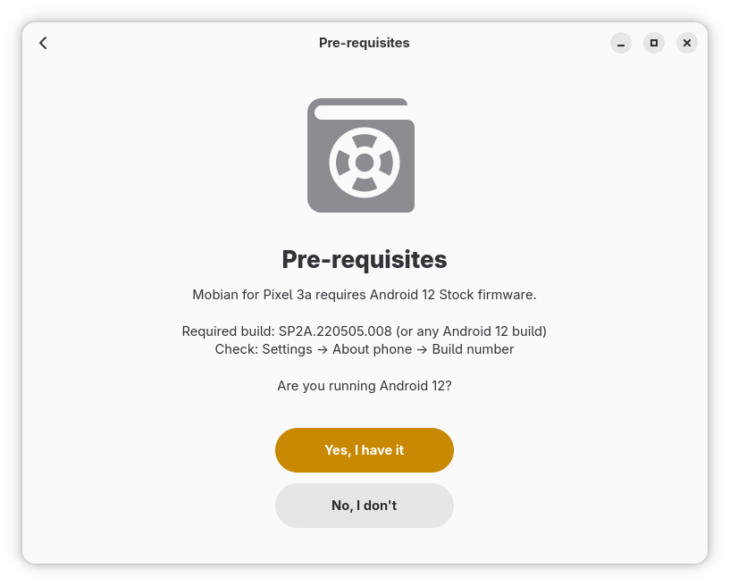
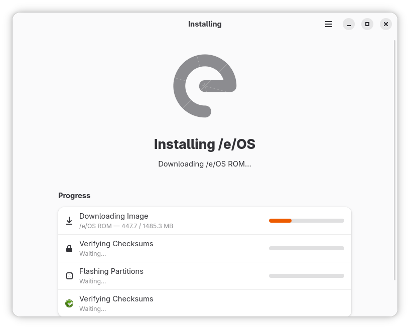
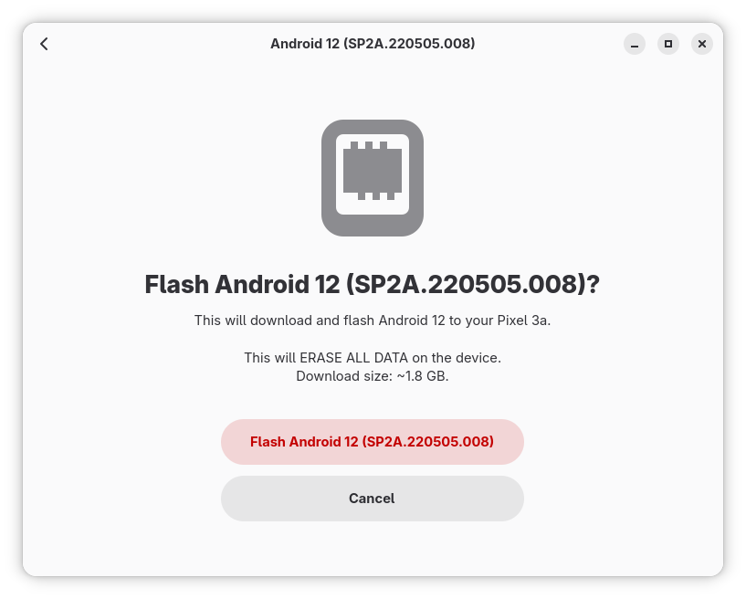
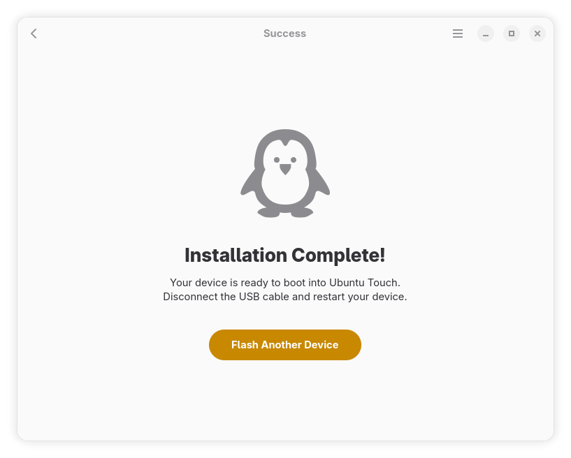

# Sidestep

A wizard for unlocking Android bootloaders and installing mobile Linux distributions.

<div align="center">



</div>

## 🎉 Version 0.3.0 - Latest Release

**Sidestep 0.3.0** adds 10 new devices with Mobian and Droidian community support, and cross-references all distros across the full 25-device catalog.

### ✨ Key Features

- **📱 Automatic Device Detection**: Plug in your phone via USB and Sidestep identifies it instantly
- **🔓 Bootloader Unlocking**: Step-by-step guidance through the unlock process for each device
- **🐧 Multi-Distro Support**: Install /e/OS, Droidian, Mobian, Ubuntu Touch, postmarketOS, and more
- **📥 Full Install Pipeline**: Download, decompress, verify checksums, and flash — all in one flow
- **📖 Device Browser**: Browse supported devices and distributions without connecting a phone
- **🔒 Fail-Safe Design**: Clear warnings, firmware checks, and battery validation before flashing

For detailed release notes and version history, see [CHANGELOG.md](CHANGELOG.md).

## Features

### Core Functionality
- **USB Device Detection** - Automatic identification via ADB and Fastboot
- **Guided Bootloader Unlock** - Device-specific unlocking steps with manufacturer instructions
- **One-Click Installation** - Select a distro and Sidestep handles download, extraction, verification, and flashing
- **Android Firmware Flashing** - Flash stock Android firmware when required as a pre-requisite
- **Real-Time Progress** - Live progress bars for download, extraction, and flashing stages

### User Experience
- **Wizard Flow** - Step-by-step navigation prevents mistakes and missed steps
- **Device Browser** - Explore supported devices, specs, and available distributions offline
- **Interface Selection** - Choose between Phosh, Plasma Mobile, and other desktop shells
- **Channel Selection** - Pick stable, development, or edge release channels per distro
- **Terminal Output** - Expandable log view for troubleshooting

### Supported Devices
- **Google** - Pixel 3a (sargo)
- **OnePlus** - OnePlus 6 (enchilada), OnePlus 6T (fajita), OnePlus 3 / 3T (oneplus3)
- **Xiaomi** - POCO M2 Pro / Redmi Note 9S / Redmi Note 9 Pro / Redmi Note 9 Pro Max / Redmi Note 10 Lite (miatoll), Pocophone F1 (beryllium), Redmi Note 7 Pro (violet)
- **Fairphone** - Fairphone 4 (FP4), Fairphone 5 (FP5)
- **SHIFT** - SHIFT6mq (axolotl)
- **Microsoft** - Surface Duo (zeta) *(experimental)*
- **Motorola** - Edge 30 (dubai), Moto Z (griffin)
- **F(x)tec** - Pro1 (pro1), Pro1 X (pro1x)
- **Sony** - Xperia 5 (bahamut), Xperia 5 II (pdx206)
- **Volla** - Phone (yggdrasil), Phone X (yggdrasilx), Phone 22 (mimameid), Phone X23 (vidofnir), Quintus (algiz), Tablet (mimir)
- **Lenovo** - ThinkPhone (bronco)

## Building from Source

```bash
# Clone the repository
git clone https://github.com/tobagin/Sidestep.git
cd Sidestep

# Build and install development version
./build.sh --dev
flatpak run io.github.tobagin.Sidestep.Dev

# Build and install production version
./build.sh
flatpak run io.github.tobagin.Sidestep
```

## Usage

### Basic Usage

Launch Sidestep from your applications menu or run:
```bash
flatpak run io.github.tobagin.Sidestep
```

1. **Connect** your Android device via USB
2. **Select** your device from the detected list
3. **Choose** a distribution to install
4. **Follow** the wizard through pre-requisites, firmware checks, and installation

### Device Browser

Browse supported devices and available distributions without connecting a phone:
- Open the hamburger menu and select **Browse Devices**
- View device specs, available distros, compatibility info, and release channels

## Privacy & Security

Sidestep is designed to respect your privacy:

- **Sandboxed** - Distributed as a Flatpak with only necessary permissions (USB access)
- **No Tracking** - No telemetry, analytics, or external data reporting
- **Verified Images** - SHA256 checksum verification for all downloaded images
- **Open Source** - Code is fully available for audit

## Contributing

Contributions are welcome! Whether it's bug reports, feature requests, or code contributions.

- Reporting Bugs: [GitHub Issues](https://github.com/tobagin/Sidestep/issues)

## License

Sidestep is licensed under the [GPL-3.0-or-later](LICENSE).

## Acknowledgments

- **GNOME** - For the GTK4 toolkit and Libadwaita
- **Rust** - For the safe, performant systems language
- **UBports** - For the Ubuntu Touch installer that inspired much of the flashing logic
- **postmarketOS** - For pioneering mobile Linux on Android hardware
- **Droidian / Mobian** - For bringing Debian to mobile devices

## Screenshots

| Device Detection | Device Details |
|:---:|:---:|
|  |  |

| Distro Selection | Channel Selection |
|:---:|:---:|
|  |  |

| Compatibility Info | Pre-requisites |
|:---:|:---:|
|  |  |

| Installing /e/OS | Installing Mobian |
|:---:|:---:|
|  |  |

| Android Firmware | Installation Complete |
|:---:|:---:|
|  |  |

---

**Sidestep** - Install Linux on mobile.
